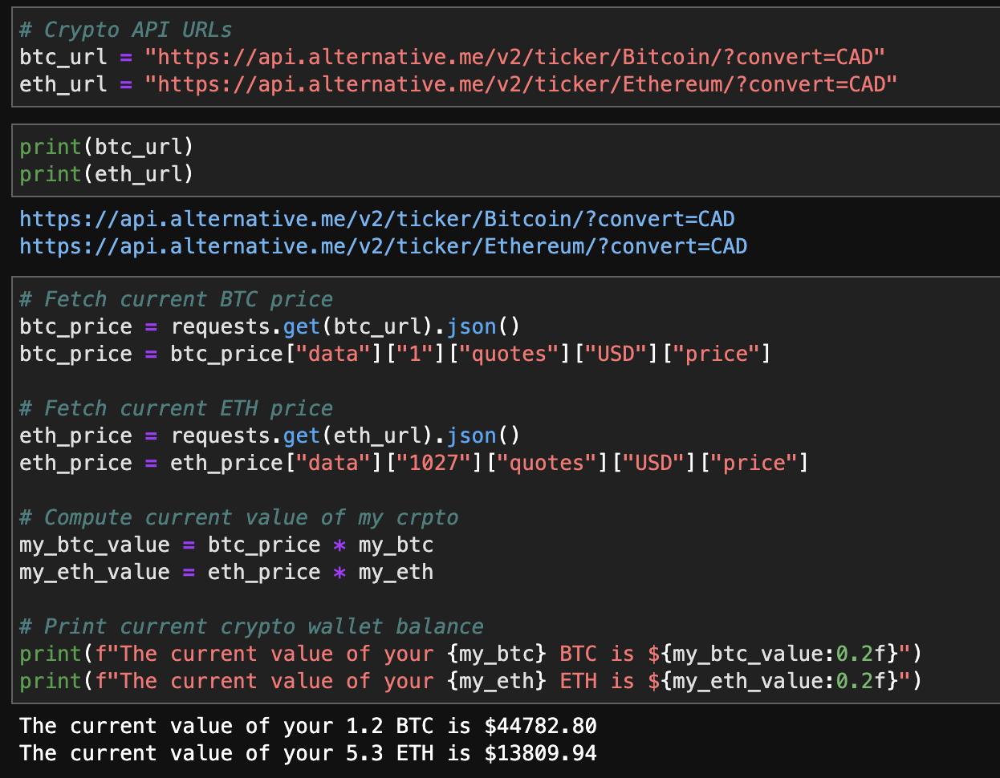
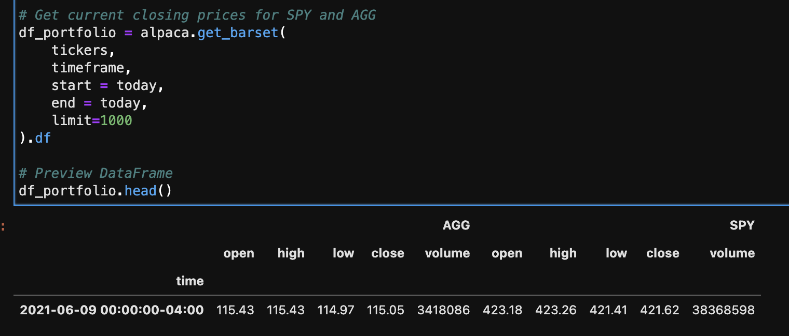
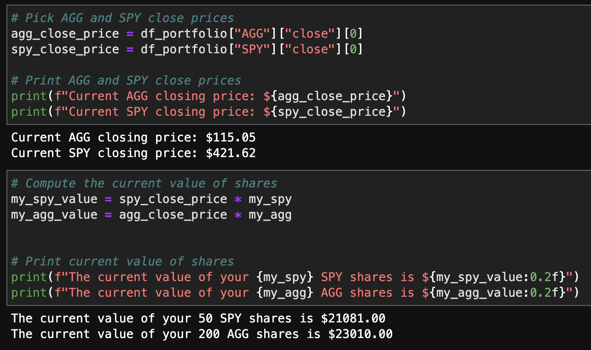
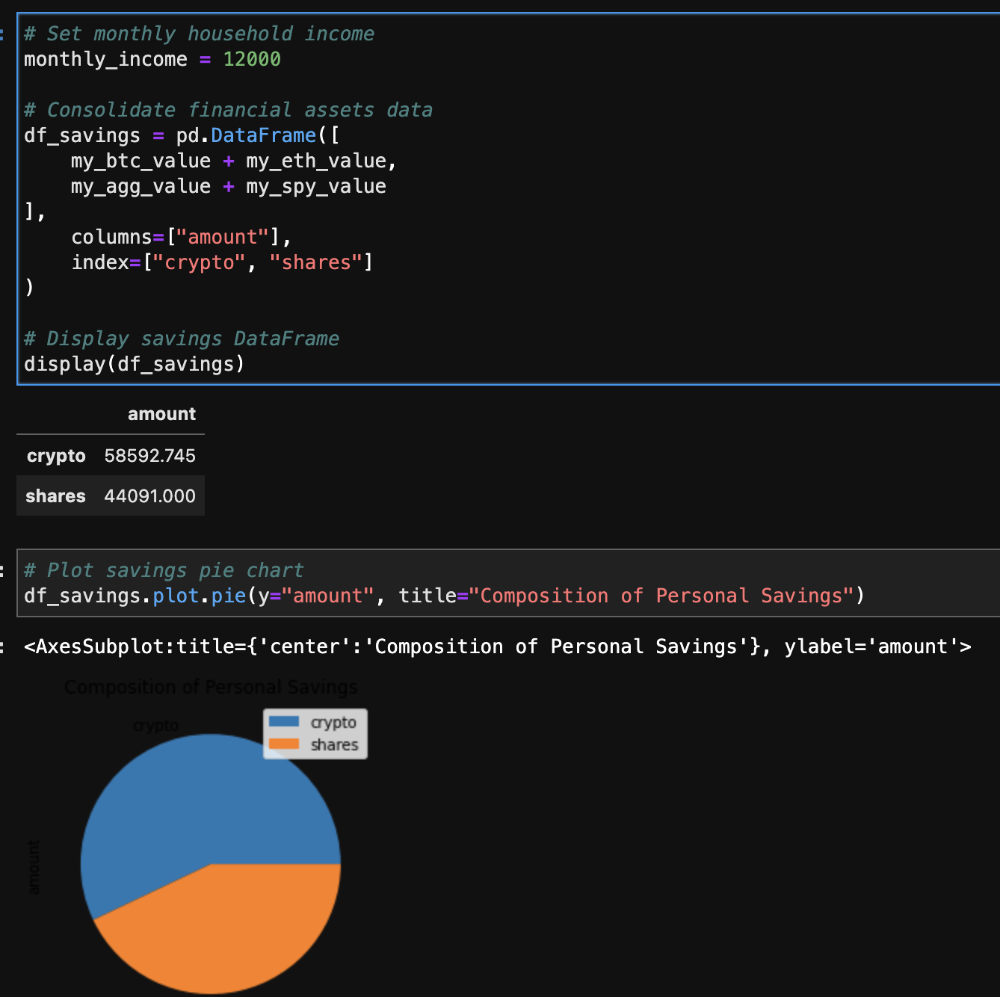
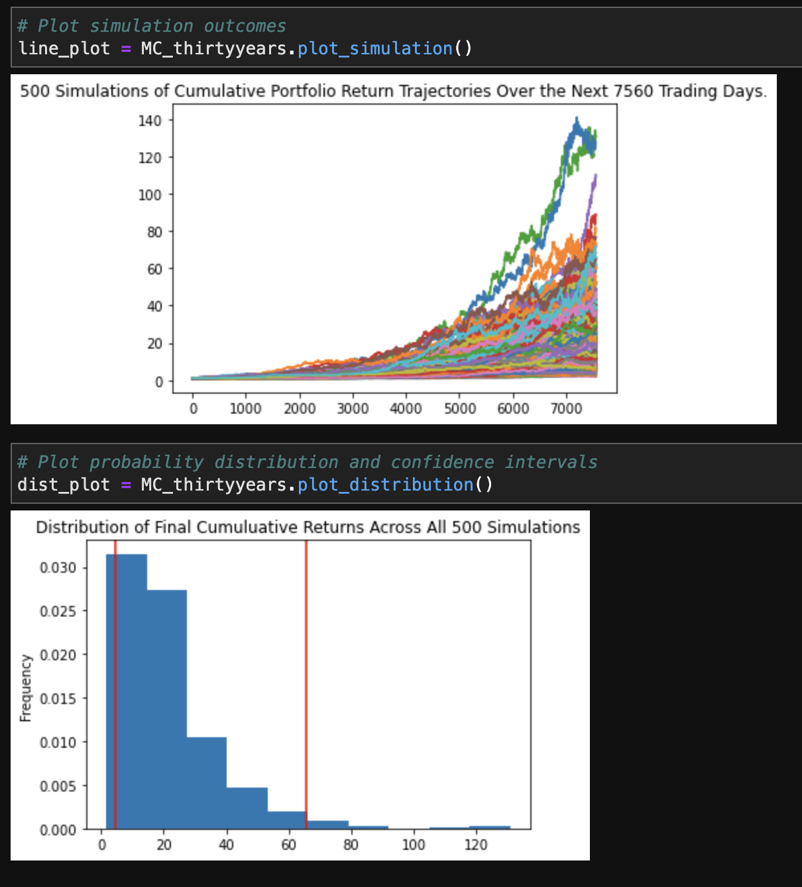
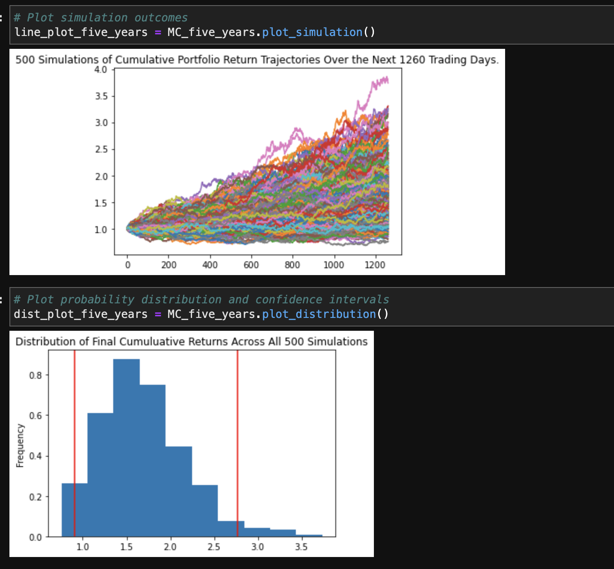

# Financial Planning with APIs

This project is focused on using API tools to gather information on cryptocurrencies, stocks and bonds in order so to assess personal finances. 

I have developed two tools which will be able to show analysis on:
1. personal savings composed of investment in shares and cryptocurrecions. This intends to gather data from APIs and analyze if an individual has enough in investments for an emergency fund.
2. The second tool was develop to gather data from the Alpaca API and run the Monte Carlo simulation to project a portfolio performace. The results are intended to read an analysis of a potention retirement portfolio.

---

### Resources

This project utilized two APIs:

* The **Alpaca Markets API** will be used to pull historical stocks and bonds information.  
    
* The **Alternative Free Crypto API** will be used to retrieve Bitcoin and Ethereum prices.

----

## Step-by-step of the project

### Part 1 - Personal Finance Planner

Fetched current crypto currency prices from API

Collected investment data and computed value of current shares

Calculated total amount in invested and ploted it for Data visualization 

At the end, calculated the ideal emergency fund and compared it against total amount in current investment.

### Part 2 - Retirement Planning

For this part of the project, I fecthed data from the API and ran Monte Carlos simulations for different investments and years. The main objective is 'simulate' how much money an individual would gain or loose if investing in these portfolios. 

The image below shows the simulation as well as distribution throughout the years, as per asked. 

Finally, we can see that this portfolio wouldn't return too great of investments as per two calculated simulations. For an early retirement the portfolio would return only a safe margin of profits.

